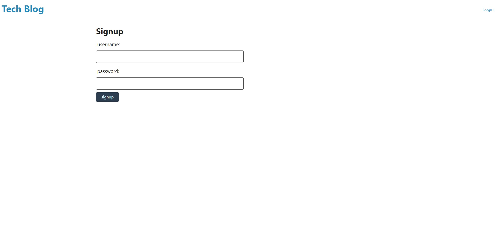

# Tech-Blog

## Description

A CMS-style blog site where developers can publish their blog posts and comment on other developers’ posts as well.

- The motivation to create this application, was to generate the opportunity to share knowledge about all things tech.

- I built this project to create a space for people to converse about different technologies and stay ahead in their field.

- This application solves the problem of having no one to tell when you make a major discovery in the tech space.

- Through the process of building this app, I learned everything I thought I knew about mysql, and heroku deployment.

## Table of Contents 

- [Installation](#installation)
- [Screenshots](#screenshots)
- [Links](#links)

## Installation

'npm i' 'node server.js' (to run application locally)

## Screenshots

## Links

- Github Project Repo: https://github.com/lindstdb/Tech-Blog
- Heroku Deployed App Link: https://fast-bayou-68389.herokuapp.com/